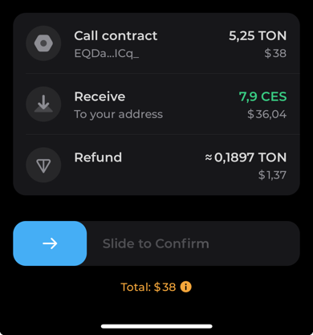

<p align="center">
  <a href="https://swap.coffee" target="blank"></a>
</p>

<p align="center">SDK for swap.coffee DEX aggregator</p>

<p align="center">
<a href="https://www.npmjs.com/package/@swap-coffee/sdk"></a>
<a href="https://opensource.org/licenses/mit"></a>
<a href="https://docs.swap.coffee"></a>
</p>

## Installation

```bash
npm install @swap-coffee/sdk
```

Documentation can be found [here](https://docs.swap.coffee).


## Basic usage

Swapping assets using our SDK and [TonConnect SDK](https://www.npmjs.com/package/@tonconnect/sdk)

```typescript
const connector = await setupTonConnect();
const routingApi = new RoutingApi();

const assetIn: ApiTokenAddress = {
  blockchain: 'ton',
  address: 'native', // stands for TON
};
const assetOut: ApiTokenAddress = {
  blockchain: 'ton',
  address: 'EQCl0S4xvoeGeFGijTzicSA8j6GiiugmJW5zxQbZTUntre-1', // CES
};

const input_amount = 5; // 5 TON

const route = await routingApi.buildRoute({
  input_token: assetIn,
  output_token: assetOut,
  output_amount: 200, // desired amount of output token
});

const transactions = await routingApi.buildTransactionsV2({
  sender_address: connector.account?.address!!,
  slippage: 0.1,
  paths: route.data.paths, // note: use route.data here
});


let messages = [];

for (const transaction of transactions.data.transactions) {
  messages.push({
    address: transaction.address,
    amount: transaction.value,
    payload: transaction.cell,
  });
}

await connector.sendTransaction({
  validUntil: Date.now() + 5 * 60 * 1000,
  messages: messages,
});

const results = await waitForTransactionResults(transactions.data.route_id, routingApi);
```
And here is our transaction:



Full example code can be found [here](examples/swap.ts)

## License

swap.coffee SDK is [MIT licensed](LICENSE).

## Copyright

swap.coffee &copy; 2024